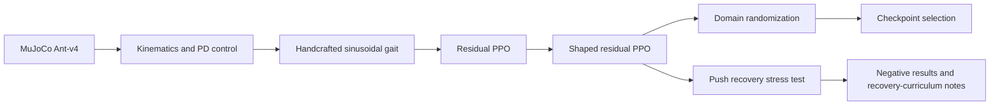
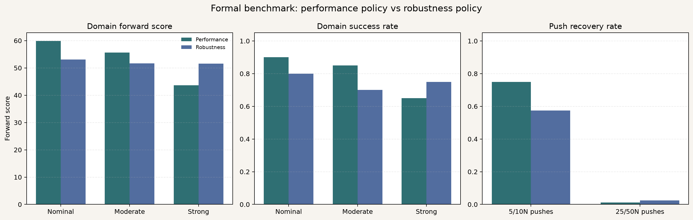

# ant-training

## A MuJoCo Mini-Lab for Studying Gait Priors, Residual PPO, and Robustness in Ant Locomotion

This repository contains a MuJoCo `Ant-v4` robot learning mini-lab for studying
how handcrafted gait priors, residual PPO, reward shaping, and
domain-randomized continuation affect locomotion performance and robustness.

The project is intentionally compact: it is not a full robotics stack, and
`Ant-v4` is a benchmark morphology rather than a real robot. The goal is to
build a clear, reproducible learning pipeline and document both successful and
negative results.

## Highlights

- Built a staged robot learning mini-lab from MuJoCo basics to residual PPO and robustness evaluation.
- Improved 1000-step forward displacement from `6.6` with a handcrafted gait baseline to `60.3` with shaped residual PPO across 20 evaluation seeds.
- Evaluated a performance-vs-robustness tradeoff under nominal, moderate, and strong domain randomization.
- Found that push recovery is a separate failure mode: surviving a backward push does not imply recovering forward locomotion.

## Key Idea

Instead of training PPO from completely random motor commands, the project first
constructs a structured sinusoidal gait prior and then learns small corrections:

```text
final_action = handcrafted_gait_action + residual_policy_action
```

- The handcrafted gait prior provides a structured locomotion prior.
- The residual policy learns small corrective actions around that prior.
- Reward shaping turns survival-oriented behavior into directed forward locomotion.

## Method Pipeline



## Main Results

Locomotion baseline comparison, `Ant-v4`, 20 seeds, 1000 max steps:

| Policy | Success | Mean x | Mean abs y | Forward score |
|---|---:|---:|---:|---:|
| shaped residual PPO 500k | 0.90 | 60.34 | 2.30 | 59.88 |
| handcrafted gait | 1.00 | 6.59 | 9.23 | 4.74 |
| vanilla PPO | 1.00 | 0.01 | 0.15 | -0.02 |
| residual PPO | 1.00 | -2.35 | 5.33 | -3.42 |
| random | 0.00 | 0.61 | 0.98 | 0.41 |

The shaped residual policy improved 1000-step forward displacement from `6.6`
for the handcrafted gait baseline to `60.3` across 20 evaluation seeds.

## Performance vs Robustness Benchmark

Formal benchmark, 20 seeds, 1000 max steps:

| Policy | Condition | Success | Mean x | Mean abs y | Forward score |
|---|---|---:|---:|---:|---:|
| Performance | nominal | 0.90 | 60.34 | 2.30 | 59.88 |
| Performance | moderate | 0.85 | 56.15 | 2.48 | 55.65 |
| Performance | strong | 0.65 | 44.24 | 2.95 | 43.65 |
| Robustness | nominal | 0.80 | 53.74 | 3.45 | 53.05 |
| Robustness | moderate | 0.70 | 52.39 | 3.82 | 51.62 |
| Robustness | strong | 0.75 | 52.48 | 4.65 | 51.55 |

The performance policy is best under nominal and moderate settings. The
robustness policy is stronger under strong randomization. This shows a tradeoff
between nominal locomotion performance and robustness.



## Push Recovery Findings

Representative push-recovery results for the performance policy:

| Condition | Success | Recovery | Forward score |
|---|---:|---:|---:|
| no push | 0.80 | 0.80 | 56.24 |
| +x 10N | 1.00 | 1.00 | 60.33 |
| -x 10N | 0.90 | 0.00 | 16.11 |
| +x 25N | 0.00 | 0.00 | 22.25 |

Key observations:

- Backward push is a clear failure mode.
- Survival does not imply recovery.
- Domain robustness does not automatically transfer to push recovery.
- Push-aware training attempts did not outperform the original 500k policy.

## Demo Videos

Performance policy:

<video src="assets/performance_demo.mp4" controls width="720"></video>

[Open performance demo](assets/performance_demo.mp4)

Robustness policy:

<video src="assets/robustness_demo.mp4" controls width="720"></video>

[Open robustness demo](assets/robustness_demo.mp4)

Full local videos:

- `results/videos/formal_benchmark_performance_best_1000step.mp4`
- `results/videos/formal_benchmark_robustness_best_1000step.mp4`

Additional local videos:

- `results/videos/ant_shaped_residual_ppo_best_500k.mp4`
- `results/videos/sinusoidal_gait_ant_best.mp4`
- `results/videos/random_ant.mp4`

## Repository Structure

```text
.
├── 01_mujoco_basics/          # MuJoCo rollout, state inspection, video recording
├── 02_kinematics/             # 2-link FK, IK, Jacobian, visualization
├── 03_control/                # PD control and trajectory tracking
├── 04_gait_controller/        # Handcrafted sinusoidal Ant gait
├── 05_rl_baselines/           # Vanilla PPO and residual PPO baselines
├── 06_reward_shaping/         # Shaped residual PPO and reward-weight sweeps
├── 07_domain_randomization/   # Robustness evaluation and DR continuation training
├── 08_push_recovery/          # Push recovery evaluation and training attempts
├── common/                    # Shared wrappers, utilities, evaluation helpers
├── configs/                   # Config files
├── reports/                   # Technical reports and result summaries
├── results/
│   ├── plots/                 # Figures used in reports and README
│   ├── tables/                # Evaluation CSV files
│   └── videos/                # Local MP4 rollouts, ignored by git by default
├── assets/                    # GitHub-friendly demo GIFs / compressed videos
└── requirements.txt
```

## Setup

Use Python 3.11 if possible.

```bash
python3.11 -m venv .venv
source .venv/bin/activate
python -m pip install --upgrade pip
python -m pip install -r requirements.txt
```

## How to Reproduce

Run commands from the repository root with the virtual environment activated.

### Baseline Comparison

```bash
python 05_rl_baselines/compare_locomotion_baselines.py \
  --episodes 20 \
  --max-steps 1000 \
  --shaped-residual-model results/logs/ant_shaped_residual_ppo_best_500k.zip \
  --deterministic \
  --output results/tables/locomotion_baseline_comparison.csv
```

### Domain Randomization Evaluation

Moderate randomization:

```bash
python 07_domain_randomization/evaluate_domain_randomization.py \
  --model results/logs/ant_shaped_residual_ppo_best_500k.zip \
  --episodes 20 \
  --max-steps 1000
```

Strong randomization:

```bash
python 07_domain_randomization/evaluate_domain_randomization.py \
  --model results/logs/ant_shaped_residual_ppo_best_500k.zip \
  --episodes 20 \
  --max-steps 1000 \
  --mass-range 0.6,1.4 \
  --friction-range 0.5,1.5 \
  --damping-range 0.5,1.5
```

### Formal Policy Benchmark

The formal benchmark tables already exist under `results/tables/formal_benchmark/`.
The summary plot can be regenerated with:

```bash
python reports/plot_formal_benchmark.py
```

### Push Recovery Evaluation

```bash
python 08_push_recovery/evaluate_push_recovery.py \
  --model results/logs/ant_shaped_residual_ppo_best_500k.zip \
  --episodes 10 \
  --max-steps 1000 \
  --push-forces 5,10,25,50 \
  --directions +x,-x,+y,-y
```

### Plot Generation

```bash
python reports/plot_stage_03_summary.py
python reports/plot_formal_benchmark.py
python 06_reward_shaping/plot_locomotion_comparison.py
```

### Video Recording

Performance policy:

```bash
python 05_rl_baselines/record_residual_policy_video.py \
  --model results/logs/ant_shaped_residual_ppo_best_500k.zip \
  --steps 1000 \
  --deterministic \
  --output results/videos/formal_benchmark_performance_best_1000step.mp4
```

Robustness policy:

```bash
python 05_rl_baselines/record_residual_policy_video.py \
  --model results/logs/dr_checkpoint_selection_from_25k_lr5e5/from25k_lr5e5_575736_steps.zip \
  --steps 1000 \
  --deterministic \
  --output results/videos/formal_benchmark_robustness_best_1000step.mp4
```

On macOS, video rendering may require running from a normal Terminal or VS Code
terminal so MuJoCo can access the graphics stack.

## Reports

- [Technical Report](reports/technical_report.md)
- [Results Index](reports/results_index.md)
- [Reproducibility Commands](reports/reproduce_commands.md)

## Key Takeaways

- Reward shaping is essential for turning survival into directed locomotion.
- Residual learning structures the policy search around a meaningful gait prior.
- Domain-randomized continuation can improve strong-randomization robustness,
  but may reduce nominal performance.
- Push recovery is a separate problem and requires a dedicated recovery reward
  and curriculum.
- Checkpoint selection matters because the final training checkpoint is not
  necessarily the best policy.

## Limitations and Future Work

- `Ant-v4` is a benchmark morphology, not a real quadruped robot.
- Push-aware training did not outperform the original 500k policy.
- Future work: shaped PPO without gait-prior ablation, checkpoint learning
  curves, mean/std or confidence intervals, realistic quadruped XML, actuator
  delay, sensor noise, terrain variation, and a ROS2 interface.
